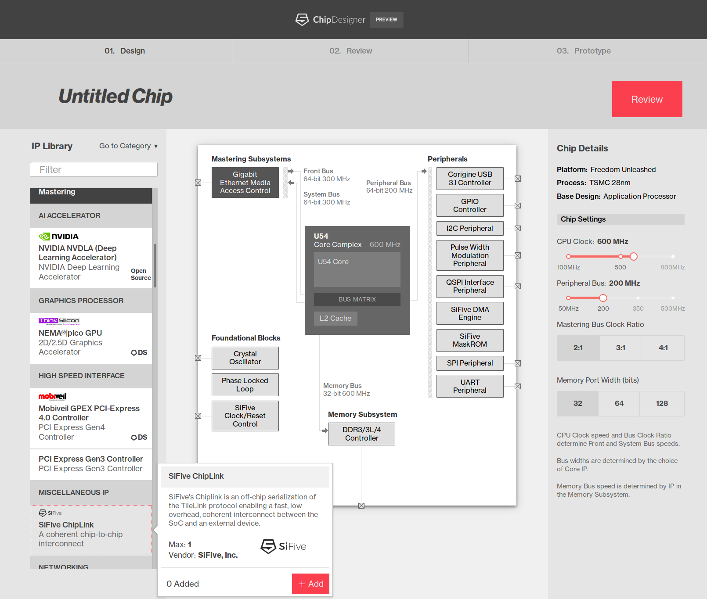

Bringing Physical Design into SCS
===========

----

Current UI (no constraints)
==========

----

Front End IP Format (flat json)
==========

.. code-block:: javascript

  const ipSpecs = [
    // SLACLDO50mA
    {
    "assignableInputs": "",
    "assignableOutputs": "",
    "biasHas": "",
    "biasReq": "1uAP, VREF",
    "block": "SLACLDO50MA",
    "cell": "LDO_50MA_TOP",
    "comments": "",
    "designShare": "N",
    "diagramRegion": "Always-on Blocks",
    "displayCategory": "Power Management",
    "displayDescription": "50mA Configurable LDO",
    "displayName": "Low Dropout Regulator, 50mA",
    "emphasis": "",
    "externalPadphyTypes": "",
    "hardSoft": "Hard",
    "iPOptions": "",
    "isCategory": false,
    "kUm2": 217.72,
    "library": "SLAC_LDO",
    "longDescription": "A low drop-out regulator (LDO) that steps down the input voltage and supplies up to 50 mA for internal or external circuits.",
    "maxQty": 1,
    "memoryBusSpeed": "",
    "padConnection": "Y",
    "padsHas": "COREBYP",
    "padsReq": "",
    "platform": "Freedom Everywhere",
    "preferredBiasSolution": "SiFiveBandgap",
    "process": "180nm",
    "requiredIp": "",
    "shortName": "",
    "specificIoPlacement": "Y",
    "status": "Installed",
    "suggestIp": "",
    "supplies": "2V-3.6V",
    "type": "LDO",
    "uuid": "608697a8-6a43-5f7b-94f6-7682e0ca9ea9",
    "vendor": "SiFive, Inc.",
    "vendorLogoFilename": "SiFiveInc.png",
    "xUm": 786.0,
    "yUm": 277.0
  },
    ]

----

Back End IP Format (scala objects)
==========

.. code-block:: scala

    package sifive.enterprise.ip.slac.ldo // Package for SLAC ldo

    import chisel3.{Input, Output}
    import Chisel._

    // ...

    //  Variables describe the LDO configuration
    case class SLACLDOConfig(
      enableInit: Boolean = true,

      trimWidth:  Int = 4,
      trimInit:   Int = 4,

      q3p3Init:   Boolean = false,
      q2p5Init:   Boolean = false,
      q1p8Init:   Boolean = true,
      q1p5Init:   Boolean = true,

      q3p3Tie:   Boolean = true,
      q2p5Tie:   Boolean = true,
      q1p8Tie:   Boolean = true,
      q1p5Tie:   Boolean = true,

      refOnTieToEnable: Boolean = true
    )

    object SLACLDOWrapper {
      def apply (gen: => SLACLDO): (LDOIO, Seq[RegField]) = {

        val ldo = Module(gen)
        val c = ldo.c
        val ldoio = Wire(new LDOIO(new LDOConfig(
          nIbias = 2,
          hasCoreBypassPad = true,
          hasVOutPad = false)
        ))

      // ...

        // Expose the Signals that don't go to a register
        ldo.io.VBG :=  ldoio.vref_ANALOG
        ldo.io.IIN1UAPLDO := ldoio.ibias_ANALOG(0)
        ldo.io.IIN1UAP    :=  ldoio.ibias_ANALOG(1)

        val q3p3Reg = Module(new AsyncResetRegVec(w = 1, init = if (c.q3p3Init) 1 else 0))
        q3p3Reg.suggestName("ldoQ3P3Reg")
        val q2p5Reg = Module(new AsyncResetRegVec(w = 1, init = if (c.q2p5Init) 1 else 0))
        q2p5Reg.suggestName("ldoQ2P5Reg")
        val q1p8Reg = Module(new AsyncResetRegVec(w = 1, init = if (c.q1p8Init) 1 else 0))
        q1p8Reg.suggestName("ldoQ1P8Reg")
        val q1p5Reg = Module(new AsyncResetRegVec(w = 1, init = if (c.q1p5Init) 1 else 0))
        q1p5Reg.suggestName("ldoQ1P5Reg")

        ldo.io.q3p3 := Mux(ldoio.test_mode_enable, c.q3p3Init.B, if (c.q3p3Tie) c.q3p3Init.B else q3p3Reg.io.q)
        ldo.io.q2p5 := Mux(ldoio.test_mode_enable, c.q2p5Init.B, if (c.q2p5Tie) c.q2p5Init.B else q2p5Reg.io.q)
        ldo.io.q1p8 := Mux(ldoio.test_mode_enable, c.q1p8Init.B, if (c.q1p8Tie) c.q1p8Init.B else q1p8Reg.io.q)
        ldo.io.q1p5 := Mux(ldoio.test_mode_enable, c.q1p5Init.B, if (c.q1p5Tie) c.q1p5Init.B else q1p5Reg.io.q)

      // ...

    //  This defines all the I/O of the VERILOG Block itself.
    //  This should match the VERILOG naming conventions.
    abstract class SLACLDO(val c: SLACLDOConfig) extends BlackBox {
      val io = new Bundle {
        val VBG        = Input(Bool()) // Analog
        val ENA        = Input(Bool())
        val IIN1UAPLDO = Input(Bool()) // Analog
        val IIN1UAP    = Input(Bool()) // Analog
        val REFON      = Input(Bool())
        val q3p3       = Input(Bool())
        val q2p5       = Input(Bool())
        val q1p8       = Input(Bool())
        val q1p5       = Input(Bool())
        val T          = Input(UInt(c.trimWidth.W))
        val COREBYP    = Input(Bool()) // Analog
      }
    }

    class SLACLDO50mA(c: SLACLDOConfig) extends SLACLDO(c) {
      require (c.trimWidth == 4, "SLACLD50mA only supports trim width = 4.")
    }

----

Three topics to discuss
===========

1. **Inputs**: *On-boarding IP*
     * What format for IP?
     * Common description between front end and back end?
2. **Outputs**: *Exporting user design*
     * What format for chip specs?
3. **Constraints**: *User experience vs. Fabrication/synthesis*
     * How free is the user’s design space?
     * Where and how to encode constraints?

----

Core and bus constraints
========================

* Bus sizes
* Bus speeds, timing, clock ratios
* Clock generation

----

Top Level Layout Constraints
========================

* Pad map and pin muxing
* Process feature conflicts between IP (DRRC issues)
* Power estimation
* Area estimation

----

IP Constraints
========================

* Interfacing to blocks and pads
    - Logic levels, PHYs, Muxing
* Biasing
    - Automated or user choice? What trade offs do we want to present to the user?
* Licensing
    - Vendor restrictions and availability
